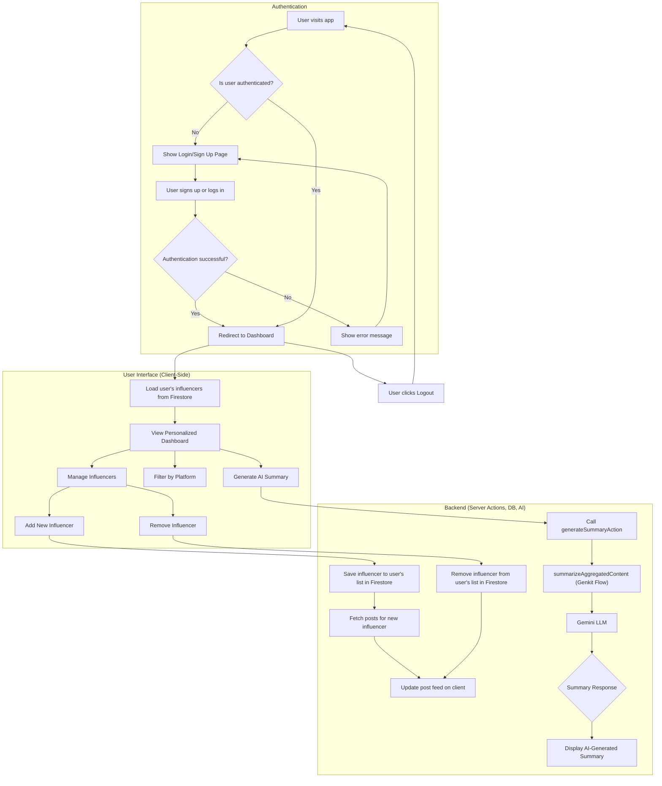

# Day 2 Completion Report: TrendTracker AI

## 1. Project Overview

Day 2 focused on transforming TrendTracker AI from a static demo into a personalized, multi-user application. We implemented core backend functionalities, including user authentication and database integration, to provide a persistent and secure experience for each user.

## 2. Key Features Completed

The following key features were implemented and are fully functional as of the end of Day 2:

*   **User Authentication**: A complete authentication system was integrated using Firebase Authentication. Users can now sign up for a new account and log in to access their personalized dashboard.
*   **Persistent Database**: We connected the application to Firestore, a NoSQL database, to store user-specific data. Each user's list of tracked influencers is now saved and retrieved from the database, ensuring data persistence across sessions.
*   **Protected Routes**: The main dashboard is now a protected route, accessible only to authenticated users. Unauthenticated users are redirected to the login page.
*   **Polished UI**: The dashboard UI/UX has been enhanced with a more robust sidebar, including user account information and a logout button. Feedback mechanisms, such as loading states and toast notifications for errors, have been improved.
*   **Date-Range Filters (Foundation)**: While not fully implemented on the UI, the backend data structure now supports timestamps that will allow for future implementation of date-range filtering for post analysis.
*   **Automated Fetching (Foundation)**: The logic to fetch posts for newly added influencers is now automated upon adding them, laying the groundwork for periodic background fetching.

## 3. Application Flowchart

The updated flowchart illustrates the new authentication flow and data logic.

## 4. Next Steps

With the core backend and personalization features in place, future development can focus on:
*   Implementing UI for date-range filtering.
*   Building out the background process for periodic post fetching.
*   Adding advanced analytics and data visualization for trend data.
*   Expanding the number of supported social media platforms.

